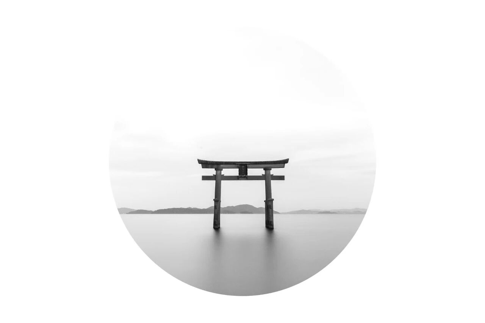
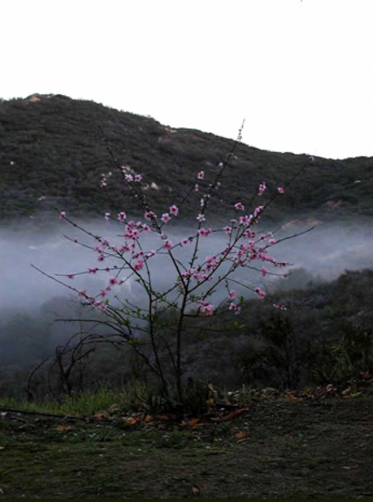
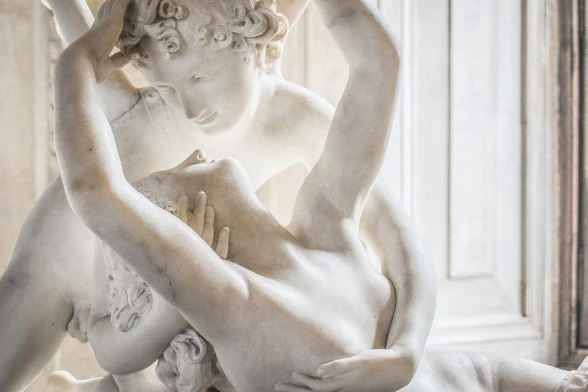
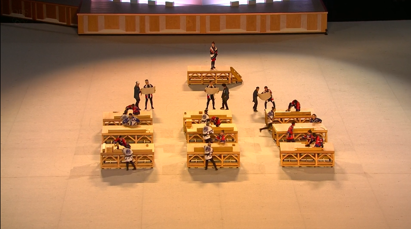
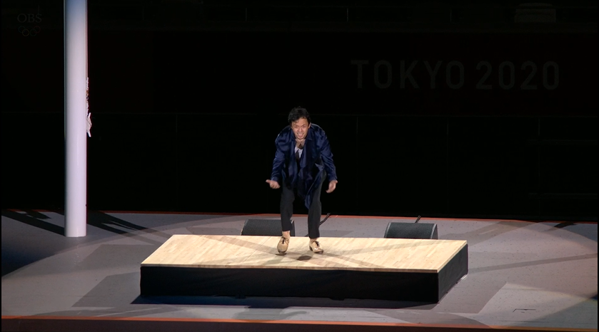
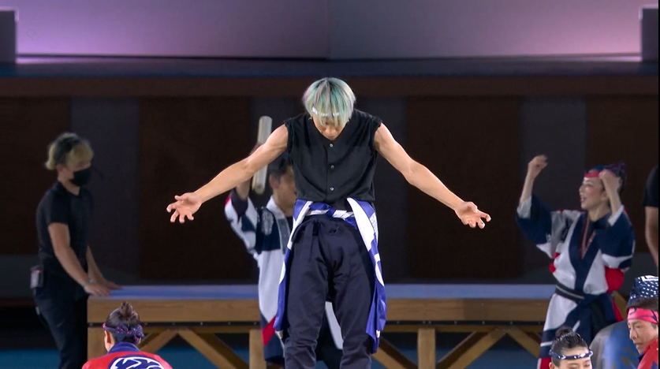
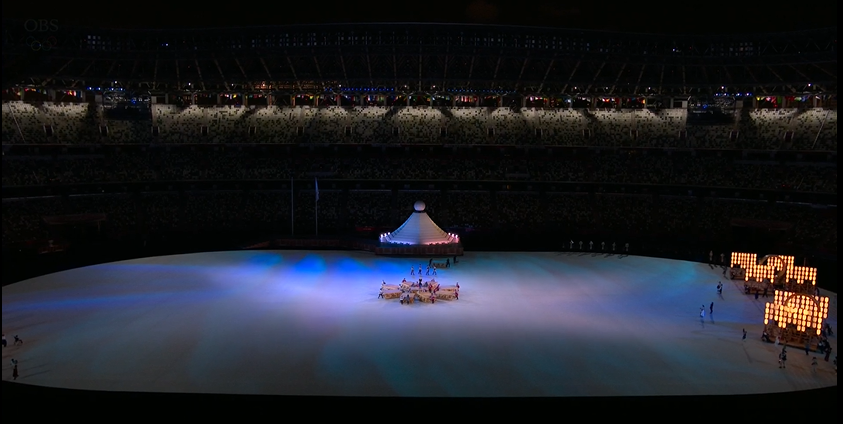
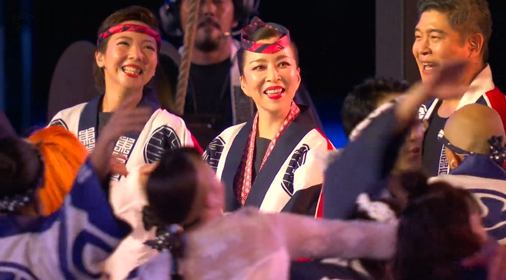
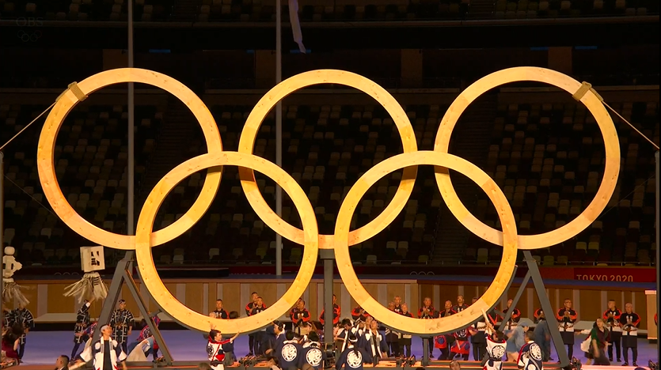
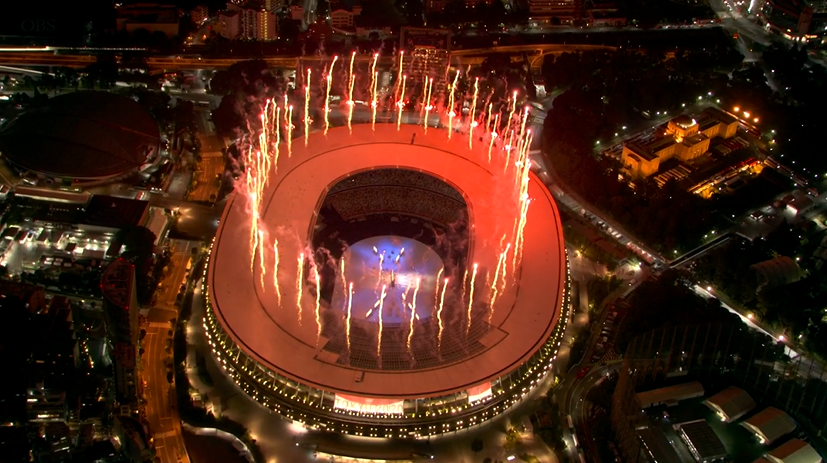

Inspired by "The Tale of Genji" and the works of Masayuki Kurokawa (Japanese architect and designer), including "The Eight Aesthetic Senses of Japan" (八つの日本の美意識), "Design and Death" (デザインと死), and "Material and Body" (素材与身体), I developed a growing interest in Japanese philosophy and aesthetics. This interest ultimately led me to Yoshinori Onishi's "Mono no aware - After the Cherry Blossoms Fall" (物哀-樱花落下后), which I read in Wang Xiangyuan's Chinese translation (from the Beijing Normal Univeristy). My appreciation for the concept of "Mono no aware" reached its peak after reading the book.

When I began reading, my intention was simple. I just wanted to understand what "Mono no aware" means, and to experience that aesthetic sensibility for myself. However, reading the book was actually far from simple, mainly due to two reasons. First, the book is full of abstract terminology, logical proofs, and references to Western philosophy. These things are difficult to grasp without background or at least some familiarity with philosophy studies. In addition to this, the Chinese edition is a word-for-word translation from the Japanese thanks to Wang Xiangyuan. While this preserves much of the author's original thoughts, it results in a text that deviates a lot from natural Chinese expressions. 

Due to these challenges, I decided to write this blog in plain language to share my humble understanding of the concept "Mono no aware", hoping that more people can encounter, understand, maybe even appreciate the beauty in it.

---

**What is "Mono no Aware"?**

The phrase "Mono no aware" (物の哀れ) breaks down simply into three components:
- Mono (物), which means "things".
- no (の), which is Japanese's "of".
- aware (哀れ), a special sense that needs further explanation of.

Literally, the term "Mono no aware" means "a special sense of things". So to understand this concept, we must go over what is the sense in "aware" (哀れ). I will use the Japanese word 哀れ from here on to avoid misleading you with the English word aware as in awareness, since the spelling is identical.

---

According to Yoshinori Onishi, 哀れ unfolds into the following five different stages:

**Stage One. Direction Expression**
In its most basic form, 哀れ expresses sorrow or pity. It is a pure psychological expression of sadness.

**Stage Two. Beyond Specific Emotions**
Here, the concept broadens from sorrow and pity to enbrace all emotional exclamations. Joy, anger, sadness, excitement - all of these can be expressed by 哀れ. For example, when people are joyful, they would say something like "哀れ! I am so happy!", and when they are angry, they can also be like "哀れ! I am so mad!".

**Stage Three. Aesthetic Awareness Through Intuitive Perception and Tranquility**
This stage marks the transition of 哀れ from pure emotional expressions to aesthetic and philosophical awareness. 哀れ now describes an intuitive perception of beauty that arises in a state of stillness.  

In Yoshinori's time, many Japanese philosophors were influenced by Western philosophy which stemmed from Plato, Aristotle, Kant, and Schopenhauer. They often see the world in dualistic terms, consisting of the phenomenal world (representation) and the noumenal world (the world as it is; some philosophers called it the "thing-in-itself", others called "Idea", "Brahman", or "Suchness"). They believed true beauty is encountered when one approaches the noumenal world, often through moments of intuitive perception and tranquil contemplation.

Sometimes this occurs when strong emotions overwhelms us, producing a momentary self-loss, where the mind goes blank with the loss of awareness in time and space, leaving only the vivid presence of beauty itself.

**Examples**
In Jin Yong's Demi-Gods and Semi-Devils (Chapter 12, “Henceforth Obsessed”), Duan Yu (段誉) encounters such a moment:
    
When Duan Yu first saw the young lady, his ears buzzed, his vision blurred, and his knees gave way—he nearly collapsed. Overwhelmed, he could only cry out, “Fairy Sister, I’ve longed for you so bitterly!” Confronted with her presence, he could no longer tell whether he stood in heaven or on earth.

This momentary self-loss in the example is the hint for understanding 哀れ at Stage Three.

**Stage Four. Expansion to Life, Existence, and Weltschmerz**
Building on Stage Three, 哀れ now expands beyond specific objects or experiences to embrace the broader significance of life and existence, with a very particular tone of sorrow. At this level, it touches on metaphysical and mystical dimensions and produces a feeling akin to Weltschmerz (“world pain”) - the sense that life is difficult and filled with sadness.

Building on Stage Three, 哀れ now expands beyond specific objects or experiences to embrace the broader significance of life, existence, impermanence, and death. Sorrow at this stage again comes back to play and becomes the dominant tone, but paradoxically, it is through sorrow that the aesthetics and pleasure emerges. I know this sounds pretty psychopathic. But let me explain.

Human is often bothered with fundamental questions like: Who are we? Why do we exist? What is the meaning of life? Where does death leads? Etc. While some of the anxieties are soothed by religions, we still can't resist thinking and worrying about them from time to time, especially when our life is tough and the mood is down. 

Yoshinori believes the daily tone of our lives is generally positive, and he argues that sorrow tends to be felt more profoundly than joy as it brings in strong contrasts that lead to contemplation. Yoshinori explains this with a metaphor of a moving train, where objects moving in the opposite dircetion appear more striking than those moving with it. And likewise, sorrow stands out more against the flow of daily joy. 

As sorrow drives reflections, it leads us to feeling closer to confronting these fundamental questions, so when we come back from such reflections, we experience a temporary release from them, and this is where the pleasure we feel comes from. 

To understand 哀れ at this level more throughly, we need to introduce Weltschmerz, which translates to "world-pain" in English. It is the despair of seeing the world as full of conflict and meaningless. Based on this perspective, the only logical thing for us to do right away is to give up and to suicide. However, throughout human history, this kind of pessimistic worldview often gives birth to existentialist thoughts, paradoxically encouraging resilience in us. And this contrast is what is leading towards aesthetics.

**Examples**
From the Tale of Genji:
- “The sky was overcast, heavy snow filled the air… Night deepened, the unfavorable moon revealed its presence. People rolled up the blinds to gaze afar. Resting on their pillows, they listened to the tolling bells of a mountain temple… A poem was sung: Life is transient, the moon does not remain, I long to follow the moon into death.”

- “As the splendid dance of Ryōō resounded, the music was magnificent. People removed their robes to reward the performers; the scene was lively and joyous… everyone was filled with delight regardless of their class. Yet Lady Murasaki, watching the spectacle, thought of her life nearing its end and was moved by a sense of infinite sorrowful beauty.”

**Stage Five. Toward Cosmic Consciousness and Oneness**
At the final stage, 哀れ is no longer bound to a sorrowful tone. Instead, it becomes a more general aesthetic sensibility that evolves toward a contemplation of Cosmic Consciousness and Oneness, meaning that the 哀れ from other objects can also be felt as it was us experiencing it.

The term "Cosmic Consciousness" is somewhat misleading. It doesn't mean the awareness of the universe, but rather it suggests that beyond our physical bodies, every one of us co-exists in the form of pure consciousness pervading the cosmos. We don't just form parts of this consciousness. We are this consciousness. And this is what Daoism calls "Oneness" (太一).

(side note: some argue that the Big Bang has shown that all things are originated from one point, and therefore we are essentially One. However, I do not hold this opinion because logically speaking, just because we might have started as one, it doesn't mean that we will remain as one afterwards.)

**Examples**

- In "Haibungaku Zatsuki", the author recalls his response to Bashō’s phrase "The butterfly recalls reality - it is the most mono no aware": When I was reading this, I felt the lonely desolation of an April spring day. The butterfly, uncertain and aimless, is not dancing among flowers but drifting helplessly with the breeze - to the left, to the right, carried nowhere, through the long spring day. This is its mono no aware... The feeling of emptiness suspended between the valley of reality and the pursuit of boundless dreams.

- In "Man's Search for Meaning", it describes a young woman in the concentration camp, knowing she was about to die, pointed at a tree and said "This tree is my only friend in solitude. I often talk to it... It says to me: 'I am here - I am life, eternal life'".

---

Now that we have explained the five aspects of 哀れ ("aware"), let me take you to the 2020 Tokyo Olympic Opening Ceremony through the lens of "Mono no aware", and hopefully you can experience it for yourself as well.

In the whole ceremony, my favorite scene was right about the 33-minute mark, where the wooden Olympic rings were assembled.

In my opinion, the performance involves two different dimensions, with one that shows the presence (as "Dasein", beings-in-the-world), and another one that is serving like a zoomed-out view that shows humanity as a species. And the two dimensions created a beautiful contrast for the ceremony.

At first (image above), the performers were looking at blueprints, building together, and working side by side. This is the first dimension - the presence. 

Around the 37-minute mark, through the solo tap-dance, the music shifted slightly, as if something were incubating (see the two images below).

Soon after that, a distinctly Japanese female voice entered into the soundtrack. At that moment, groups of people came together from all directions, pushing the wooden Olympic rings towards the center of the stage. 

This voice carried a sense of solemn, reminding us of impermanence, fragility, and the smallness of human life. This is the second dimension. These elements made me felt anxious and heavy. Yet, on stage, the performers were joyful, smiling as they collaborated. They carried no sorrow, only vitality, like cherry blossoms that bloom with full strength despite their inevitable fall, as if its only purpose in the world is to exist, even just for a short time.

Finally, when the assembly for the five wooden rings was completed, fireworks lit up the sky.

What struck me most was not the fireworks at the stadium, but the momentary self-loss I experienced as I watched the ceremony from my computer, and the emotion that lingered long after the program ended.

And this, I realized, was "Mono no aware". How about you?

**The End**

